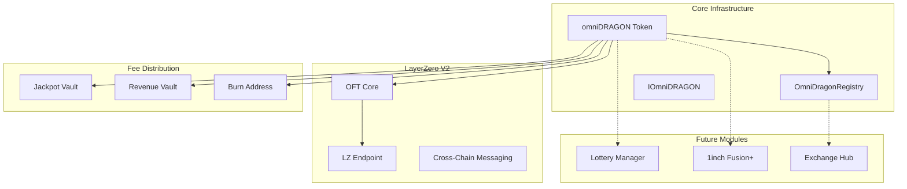

# 🏗️ Architecture Overview - omni-fusion-lottery

## 🎯 **High-Level Architecture**



## 🔧 **Core Components**

### **1. OmniDragonRegistry**
**Purpose**: Multi-chain configuration and deployment management

**Key Features**:
- **Chain Configuration**: Store chain-specific settings (wrapped tokens, DEX routers)
- **LayerZero Integration**: Endpoint and EID mapping for cross-chain operations
- **CREATE2 Support**: Deterministic address deployment across chains
- **Security**: DoS protection, pagination, comprehensive validation

**Architecture**:
```solidity
contract OmniDragonRegistry is IOmniDragonRegistry, Ownable {
    // Chain configuration storage
    mapping(uint16 => ChainConfig) private chainConfigs;
    
    // LayerZero endpoint mapping  
    mapping(uint256 => uint32) public chainIdToEid;
    mapping(uint16 => address) public layerZeroEndpoints;
    
    // DoS protection
    uint256 public constant MAX_SUPPORTED_CHAINS = 50;
}
```

### **2. omniDRAGON Token**
**Purpose**: Cross-chain token with fee-on-transfer and lottery integration

**Key Features**:
- **LayerZero OFT V2**: Real cross-chain token functionality
- **Fee-on-Transfer**: Automatic fee deduction on DEX trades
- **Immediate Distribution**: No accumulation - instant fee distribution
- **Lottery Integration**: Hooks for future lottery system
- **Security**: ReentrancyGuard, emergency controls, access management

**Architecture**:
```solidity
contract omniDRAGON is OFT, ReentrancyGuard, IOmniDRAGON {
    // Fee structure (packed for gas efficiency)
    struct Fees {
        uint16 jackpot;   // 690 (6.9%)
        uint16 veDRAGON;  // 241 (2.41%) 
        uint16 burn;      // 69 (0.69%)
        uint16 total;     // 1000 (10%)
    }
    
    // Core fee distribution
    function _update(address from, address to, uint256 amount) internal override {
        // Detect DEX trades and apply fees
        bool isBuy = isPair[from];
        bool isSell = isPair[to];
        
        if (feesEnabled && (isBuy || isSell)) {
            // Immediate fee distribution
            distributeFees(amount, isBuy);
        }
    }
}
```

## 💰 **Fee Distribution System**

### **Fee Structure (10% Total)**
```
Buy/Sell Transaction (100 DRAGON):
├── 90 DRAGON → User (after fees)
├── 6.9 DRAGON → Jackpot Vault (6.9%)
├── 2.41 DRAGON → Revenue Vault (2.41%)
└── 0.69 DRAGON → Burn Address (0.69%)
```

### **Distribution Flow**
1. **Transaction Detection**: DEX pair address detection
2. **Fee Calculation**: Basis points calculation (10,000 = 100%)
3. **Immediate Transfer**: Direct transfer to vaults (no accumulation)
4. **Event Emission**: Transparent fee tracking

```solidity
function calculateFees(uint256 amount, bool isBuy) 
    public view returns (uint256 jackpotFee, uint256 revenueFee, uint256 burnFee) {
    
    Fees memory fees = isBuy ? buyFees : sellFees;
    
    jackpotFee = (amount * fees.jackpot) / BASIS_POINTS;  // 6.9%
    revenueFee = (amount * fees.veDRAGON) / BASIS_POINTS; // 2.41%
    burnFee = (amount * fees.burn) / BASIS_POINTS;        // 0.69%
}
```

## 🌐 **Cross-Chain Architecture**

### **LayerZero OFT V2 Integration**
```solidity
// Cross-chain transfer implementation
function crossChainTransfer(
    uint32 dstEid,      // Destination endpoint ID
    address to,         // Recipient address
    uint256 amount,     // Amount to transfer
    bytes calldata extraOptions
) external payable returns (bytes32 guid) {
    
    // Build SendParam for LayerZero
    SendParam memory sendParam = SendParam({
        dstEid: dstEid,
        to: bytes32(uint256(uint160(to))),
        amountLD: amount,
        minAmountLD: amount,
        extraOptions: extraOptions,
        composeMsg: "",
        oftCmd: ""
    });
    
    // Quote and execute transfer
    MessagingFee memory fee = this.quoteSend(sendParam, false);
    (MessagingReceipt memory receipt, ) = this.send(sendParam, fee, payable(msg.sender));
    
    return receipt.guid;
}
```

### **Supported Chains**
| Chain | Chain ID | LayerZero EID | Status |
|-------|----------|---------------|---------|
| Sonic | 146 | TBD | ✅ Primary |
| Arbitrum | 42161 | 30110 | ✅ Ready |
| Avalanche | 43114 | 30106 | ✅ Ready |
| Ethereum | 1 | 30101 | 🔧 Configured |
| Polygon | 137 | 30109 | 🔧 Configured |
| TAC | 239 | 30377 | 🔧 Configured |
| BSC | 56 | 30102 | 🔧 Configured |

## 🔒 **Security Architecture**

### **Access Control**
```solidity
// Multi-level access control
modifier onlyOwner() { ... }           // Contract owner
modifier whenTradingEnabled() { ... }  // Trading gate
modifier whenNotPaused() { ... }       // Emergency pause
modifier whenNotEmergency() { ... }    // Emergency mode
modifier validAddress(address) { ... } // Input validation
```

### **Security Features**
1. **ReentrancyGuard**: Protection against reentrancy attacks
2. **Custom Errors**: Gas-efficient error handling
3. **Emergency Mode**: Contract pause functionality
4. **Transfer Limits**: Maximum single transfer caps
5. **Fee Limits**: Maximum 25% fee protection
6. **Zero Address Validation**: Input sanitization

### **Risk Mitigation**
```solidity
// Gas optimization and attack prevention
uint256 public constant MAX_SINGLE_TRANSFER = 1_000_000 * 10 ** 18;
uint256 public constant MAX_FEE_BPS = 2500; // 25% maximum
address public constant DEAD_ADDRESS = 0x000000000000000000000000000000000000dEaD;

// Try-catch for external calls
function _triggerLottery(address trader, uint256 amount) internal {
    if (lotteryManager == address(0)) return;
    
    try IOmniDragonLotteryManager(lotteryManager).enterLottery(trader, amount) {
        emit LotteryTriggered(trader, amount, amount / (10 ** 17));
    } catch {
        // Silently fail to prevent blocking trades
    }
}
```

## 📊 **Gas Optimization Strategy**

### **Storage Optimization**
```solidity
// Packed structs for gas efficiency
struct Fees {
    uint16 jackpot;   // 2 bytes
    uint16 veDRAGON;  // 2 bytes  
    uint16 burn;      // 2 bytes
    uint16 total;     // 2 bytes
}                     // Total: 8 bytes (single storage slot)

struct ControlFlags {
    bool feesEnabled;
    bool tradingEnabled;
    bool initialMintCompleted;
    bool paused;
    bool emergencyMode;
}                     // Packed into single slot
```

### **Computation Optimization**
- **Basis Points**: Efficient percentage calculations
- **Custom Errors**: Lower gas than require strings
- **Immutable Variables**: REGISTRY and DELEGATE
- **View Functions**: State reading optimization

## 🔮 **Future Extensions**

### **Phase 2: Lottery Integration**
```solidity
interface IOmniDragonLotteryManager {
    function enterLottery(address trader, uint256 amount) external;
    function triggerDraw() external;
    function getWinners() external view returns (address[] memory);
}
```

### **Phase 3: 1inch Fusion+ Integration**
```solidity
interface IFusionPlusIntegration {
    function createCrossChainIntent(
        uint256 srcChainId,
        uint256 dstChainId,
        address srcToken,
        address dstToken,
        uint256 amount
    ) external returns (bytes32 intentId);
}
```

### **Phase 4: Exchange Hub**
```solidity
interface IStateChannelExchangeHub {
    function openChannel(address counterparty) external payable;
    function closeChannel(bytes32 channelId) external;
    function executeTradeIntent(bytes calldata intent) external;
}
```

## 📈 **Performance Metrics**

### **Contract Sizes**
- **OmniDragonRegistry**: ~8KB (optimized)
- **omniDRAGON**: ~12KB (feature-rich)
- **Interfaces**: ~2KB each (minimal)

### **Gas Costs** (Estimated)
- **Deployment**: ~3M gas
- **Transfer (no fees)**: ~21K gas
- **Transfer (with fees)**: ~80K gas
- **Cross-chain transfer**: ~150K gas
- **Admin functions**: ~25-50K gas

### **Scalability**
- **Throughput**: Limited by LayerZero message throughput
- **Capacity**: Unlimited token supply within uint256
- **Chains**: 50+ chains supported via registry

---

**Architecture Status**: 🟢 **Production Ready** - Scalable, secure, and optimized